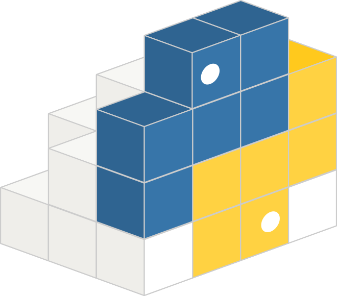

<h1 align="center">  Hi there, I'm Jitesh Gosar!</h1>
<!--# 👋 Hi there, I'm Jitesh Gosar!-->

I am an AI engineer from India :india: and now working in Japan :jp:. I am interested in data science, deep learning, computer vision, 3D simulations, and robotics. I love playing chess, reading and discussing philosophy, and traveling!

## Connect with me 

[][website]
[][linkedin]
[][pypi]
[][sketchfeb]
[][github]
[][youtube]
[][facebook]
[][gmail]
[][instagram]
[][line]

<em>Don't hesitate to get in touch!</em>

## Languages and Tools

## Github Stats

<table><tr><td valign="top" width="50%">

</td><td valign="top" width="50%">

</td></tr></table>  

[website]: https://JiteshGosar.com/blog
[pypi]: https://pypi.com/Jitesh17
[github]: https://github.com/Jitesh17
[linkedin]: https://www.linkedin.com/in/jiteshgosar
[facebook]: https://www.facebook.com/gosarjitesh
[youtube]: https://www.youtube.com/channel/UCNoGSPhTJ5ipcWa2Ai4mM_g
[sketchfeb]: https://sketchfab.com/Jitesh17
[gmail]: https://JiteshGosar.com
[instagram]: https://instagram.com/Jitesh.17
[line]: https://instagram.com/Jitesh.17
<!--
**Jitesh17/Jitesh17** is a ✨ _special_ ✨ repository because its `README.md` (this file) appears on your GitHub profile.

Here are some ideas to get you started:

- 🔭 I’m currently working on ...
- 🌱 I’m currently learning ...
- 👯 I’m looking to collaborate on ...
- 🤔 I’m looking for help with ...
- 💬 Ask me about ...
- 📫 How to reach me: ...
- 😄 Pronouns: ...
- ⚡ Fun fact: ...
-->
